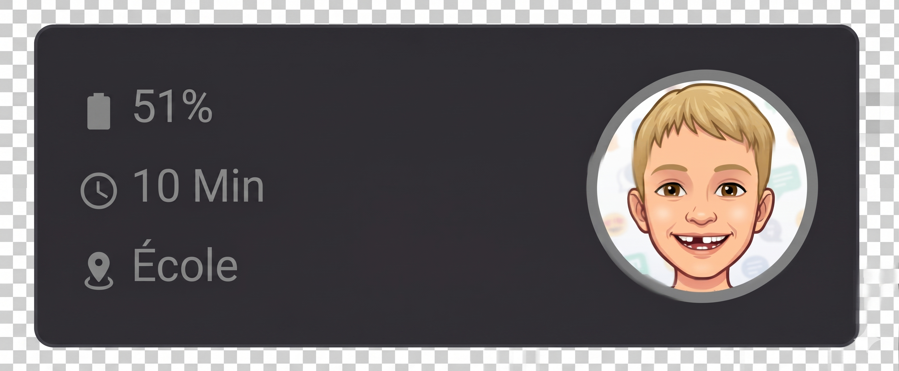

[](https://hacs.xyz/)


[](https://github.com/ghislaingaillot/savefamily-hacs/actions/workflows/validate.yaml)
[](https://github.com/ghislaingaillot/savefamily-hacs/actions/workflows/hassfest.yaml)

# SaveFamily — Home Assistant Integration

*[Français ci-dessous](#savefamily--intégration-home-assistant)*

Unofficial Home Assistant integration for **SaveFamily** GPS smartwatches for kids.

This integration exposes the GPS position, battery level, step counter and connection status of each watch in Home Assistant.

> **Technical note:** SaveFamily runs on the shared 3G Electronics backend (`myaqsh.com`), the same platform used by YQT Smart, SeTracker and CarePro+. This integration is inspired by the open-source project [yqt-smart-api](https://github.com/Niek/yqt-smart-api).

---

## Installation

### Via HACS (recommended)

[](https://my.home-assistant.io/redirect/hacs_repository/?owner=ghislaingaillot&repository=savefamily-hacs&category=integration)

Click the button above, then **Download** in HACS, then restart Home Assistant.

<details>
<summary>Manual steps (if the button doesn't work)</summary>

1. Open HACS in Home Assistant
2. Go to **Integrations** → ⋮ → **Custom repositories**
3. Add the URL: `https://github.com/ghislaingaillot/savefamily-hacs`
4. Category: **Integration**
5. Search for **SaveFamily** and click **Download**
6. Restart Home Assistant

</details>

### Manual installation

1. Download the [latest release](https://github.com/ghislaingaillot/savefamily-hacs/releases/latest)
2. Copy the `custom_components/savefamily/` folder into your `config/custom_components/` directory
3. Restart Home Assistant

---

## Configuration

1. Go to **Settings** → **Devices & Services** → **Add Integration**
2. Search for **SaveFamily**
3. Fill in the form:

| Field | Description |
|-------|-------------|
| **Region** | Geographic server. Use `europe` for France/Spain |
| **Login** | Email or phone number of your SaveFamily account |
| **Password** | Your SaveFamily account password |
| **App ID** *(advanced)* | Application identifier — leave the default value |

> **Connection issue?** If you get an "Invalid authentication" error, see the [Troubleshooting](#troubleshooting) section.

---

## Available entities

The integration creates the following entities for **each watch** linked to the account. Entity IDs are derived from the entity names in Home Assistant's language; the examples below are for an English installation (a French one gives `_localisation`, `_batterie`, etc.).

### Device Tracker

| Entity | Description |
|--------|-------------|
| `device_tracker.<name>_location` | Real-time GPS position on the Home Assistant map |

Extra attributes: `did`, `did_id`, `model`, `address`, `speed_kmh`, `direction_degrees`, `accuracy_m`, `position_timestamp`, `poll_status`, `poll_message`

### Sensors

| Entity | Unit | Description |
|--------|------|-------------|
| `sensor.<name>_battery` | % | Watch battery level |
| `sensor.<name>_last_fix` | timestamp | Timestamp of the last GPS update |
| `sensor.<name>_steps` | steps | Daily step count *(model-dependent)* |

### Binary Sensors

| Entity | Class | Description |
|--------|-------|-------------|
| `binary_sensor.<name>_online` | connectivity | `ON` if the last position is less than 15 minutes old |
| `binary_sensor.<name>_location_stale` | problem | `ON` if the last position is older than 30 minutes |

### Buttons

| Entity | Description |
|--------|-------------|
| `button.<name>_refresh_location` | Sends a GPS poll command to the watch to force an immediate update |

---

## Dashboard example

Here is an example card for a Lovelace dashboard:



The card shows the battery level, the time since the last GPS update, and the current location zone — along with the child's profile picture.

---

## Data refresh

The integration polls the API every **5 minutes**. The refresh button sends an asynchronous command to the watch, then triggers a new poll 20 seconds later.

---

## Troubleshooting

### Authentication error — "Invalid authentication"

The server rejected the login (`Either account is not registered, Area selected below is incorrect or your entry may contain spaces.` in the Home Assistant logs). Check, in this order:

1. **Region** — an account only exists on one regional server. Log out of the SaveFamily app: the login screen shows the selected area. Choose the same region in Home Assistant.
2. **Login** — use exactly the identifier you use in the app: if the account was created with a phone number, enter the phone number (same format), not the email.
3. **Password** — log out and back into the app with the same password to make sure it is still valid.
4. **App** — this integration only supports watches managed through the **SaveFamily** app on the `myaqsh.com` backend (Android package `com.tgelec.savefamily`). Watches managed by another app use a different backend and are not supported.

The **App ID** field is not involved: the server returns the same response whatever its value, so keep the default (`aaagg11145`).

> Intercepting the app traffic with mitmproxy no longer works since v0.4.1: the API now uses mutual TLS with encrypted payloads. It is not needed anyway.

### Enable debug logs

Add to `configuration.yaml`:

```yaml
logger:
  default: warning
  logs:
    custom_components.savefamily: debug
```

---

## Contributing

Contributions are welcome! To suggest an improvement or report a bug:

1. Open an [issue](https://github.com/ghislaingaillot/savefamily-hacs/issues) using the appropriate template
2. Or submit a Pull Request

---

## Credits

- [Niek](https://github.com/Niek) for the [yqt-smart-api](https://github.com/Niek/yqt-smart-api) project and the reverse engineering documentation of the 3G Electronics / myaqsh.com platform
- [SaveFamily](https://savefamily.es) for the connected watches

---

## License

This project is licensed under the [MIT License](LICENSE).

---

## Disclaimer

This is an unofficial project, not affiliated with SaveFamily. It is provided "as is", without warranty of any kind. Use at your own risk.

---
---

# SaveFamily — Intégration Home Assistant

Intégration Home Assistant non officielle pour les montres connectées **SaveFamily** (montres GPS pour enfants).

Cette intégration expose la position GPS, le niveau de batterie, le compteur de pas et le statut de connexion de chaque montre dans Home Assistant.

> **Note technique** : SaveFamily utilise la plateforme backend partagée de 3G Electronics (`myaqsh.com`), identique à YQT Smart, SeTracker et CarePro+. Cette intégration est adaptée du projet open-source [yqt-smart-api](https://github.com/Niek/yqt-smart-api).

---

## Installation

### Via HACS (recommandé)

[](https://my.home-assistant.io/redirect/hacs_repository/?owner=ghislaingaillot&repository=savefamily-hacs&category=integration)

Cliquez sur le bouton ci-dessus, puis sur **Télécharger** dans HACS, puis redémarrez Home Assistant.

<details>
<summary>Étapes manuelles (si le bouton ne fonctionne pas)</summary>

1. Ouvrir HACS dans Home Assistant
2. Aller dans **Intégrations** → ⋮ → **Dépôts personnalisés**
3. Ajouter l'URL : `https://github.com/ghislaingaillot/savefamily-hacs`
4. Catégorie : **Integration**
5. Rechercher **SaveFamily** et cliquer sur **Télécharger**
6. Redémarrer Home Assistant

</details>

### Installation manuelle

1. Télécharger la [dernière version](https://github.com/ghislaingaillot/savefamily-hacs/releases/latest)
2. Copier le dossier `custom_components/savefamily/` dans votre répertoire `config/custom_components/`
3. Redémarrer Home Assistant

---

## Configuration

1. Aller dans **Paramètres** → **Appareils et services** → **Ajouter une intégration**
2. Rechercher **SaveFamily**
3. Remplir le formulaire :

| Champ | Description |
|-------|-------------|
| **Région** | Serveur géographique. Choisir `europe` pour la France/Espagne |
| **Compte** | Email ou numéro de téléphone du compte SaveFamily |
| **Mot de passe** | Mot de passe du compte SaveFamily |
| **App ID** *(avancé)* | Identifiant d'application — laisser la valeur par défaut |

> **Problème de connexion ?** Si vous obtenez une erreur "Authentification invalide", voir la section [Dépannage](#dépannage).

---

## Entités disponibles

L'intégration crée les entités suivantes pour **chaque montre** associée au compte. Les identifiants d'entités sont dérivés des noms dans la langue de Home Assistant ; les exemples ci-dessous correspondent à une installation en français.

### Device Tracker

| Entité | Description |
|--------|-------------|
| `device_tracker.<nom>_localisation` | Position GPS en temps réel sur la carte Home Assistant |

Attributs supplémentaires : `did`, `did_id`, `model`, `address`, `speed_kmh`, `direction_degrees`, `accuracy_m`, `position_timestamp`, `poll_status`, `poll_message`

### Capteurs (Sensors)

| Entité | Unité | Description |
|--------|-------|-------------|
| `sensor.<nom>_batterie` | % | Niveau de charge de la montre |
| `sensor.<nom>_derniere_position` | timestamp | Horodatage de la dernière mise à jour GPS |
| `sensor.<nom>_pas` | steps | Nombre de pas du jour *(selon le modèle)* |

### Capteurs binaires (Binary Sensors)

| Entité | Classe | Description |
|--------|--------|-------------|
| `binary_sensor.<nom>_en_ligne` | connectivity | `ON` si la dernière position date de moins de 15 minutes |
| `binary_sensor.<nom>_position_obsolete` | problem | `ON` si la dernière position a plus de 30 minutes |

### Boutons (Buttons)

| Entité | Description |
|--------|-------------|
| `button.<nom>_rafraichir_la_position` | Envoie une commande GPS à la montre pour forcer une mise à jour immédiate |

---

## Exemple de carte dashboard

Voici un exemple de carte pour un tableau de bord Lovelace :


La carte affiche le niveau de batterie, le temps écoulé depuis la dernière position GPS et la zone de localisation actuelle — ainsi que la photo de profil de l'enfant.

---

## Mise à jour des données

L'intégration interroge l'API toutes les **5 minutes**. Le bouton "Rafraîchir la position" envoie une commande asynchrone à la montre, puis relance une interrogation 20 secondes plus tard.

---

## Dépannage

### Erreur d'authentification — "Authentification invalide"

Le serveur a refusé la connexion (`Either account is not registered, Area selected below is incorrect or your entry may contain spaces.` dans les logs de Home Assistant). Vérifier, dans l'ordre :

1. **Région** — un compte n'existe que sur un seul serveur régional. Se déconnecter de l'application SaveFamily : l'écran de connexion affiche la zone sélectionnée. Choisir la même région dans Home Assistant.
2. **Compte** — saisir exactement l'identifiant utilisé dans l'application : si le compte a été créé avec un numéro de téléphone, saisir le numéro (même format), pas l'email.
3. **Mot de passe** — se déconnecter puis se reconnecter dans l'application avec le même mot de passe pour vérifier qu'il est toujours valide.
4. **Application** — cette intégration ne prend en charge que les montres gérées par l'application **SaveFamily** sur le backend `myaqsh.com` (package Android `com.tgelec.savefamily`). Les montres gérées par une autre application utilisent un autre backend et ne sont pas prises en charge.

Le champ **App ID** n'est pas en cause : le serveur renvoie la même réponse quelle que soit sa valeur, garder la valeur par défaut (`aaagg11145`).

> L'interception du trafic de l'application avec mitmproxy ne fonctionne plus depuis la v0.4.1 : l'API utilise désormais du TLS mutuel avec des données chiffrées. Ce n'est de toute façon plus nécessaire.

### Activer les logs de debug

Ajouter dans `configuration.yaml` :

```yaml
logger:
  default: warning
  logs:
    custom_components.savefamily: debug
```

---

## Contribution

Les contributions sont les bienvenues ! Pour proposer une amélioration ou signaler un bug :

1. Ouvrir une [issue](https://github.com/ghislaingaillot/savefamily-hacs/issues) en utilisant le template approprié
2. Ou soumettre une Pull Request

---

## Crédits

- [Niek](https://github.com/Niek) pour le projet [yqt-smart-api](https://github.com/Niek/yqt-smart-api) et la documentation de reverse engineering de la plateforme 3G Electronics / myaqsh.com
- [SaveFamily](https://savefamily.es) pour les montres connectées

---

## Licence

Ce projet est sous licence [MIT](LICENSE).

---

## Avertissement

Cette intégration est un projet non officiel, sans lien avec SaveFamily. Elle est fournie "telle quelle", sans garantie d'aucune sorte. Utilisez-la à vos propres risques.
